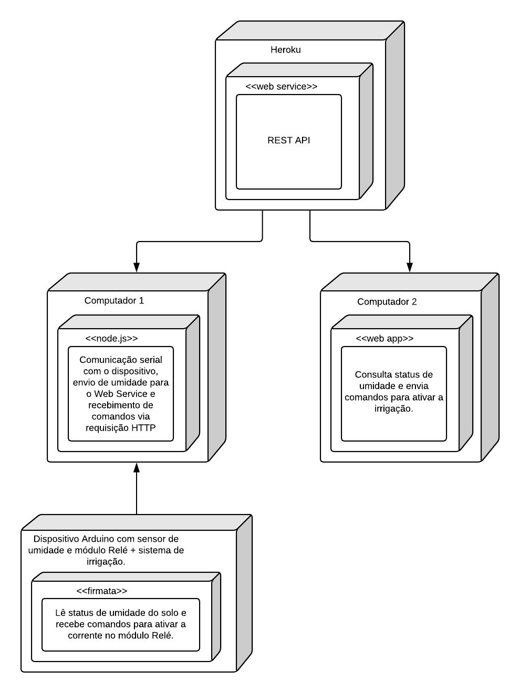
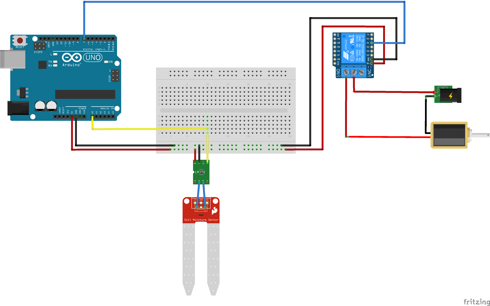

# *Nome do Projeto*

## Ideia

Um sistema que acompanha a umidade do solo de uma plantação e em caso de solo seco, emite um comando para ativar o mecanismo de irrigação. Será possível acompanhar o status do solo em tempo real através de uma aplicação web, bem como controlar a irrigação manualmente por ela.

## Diagrama de implantação

## Montagem do dispositivo

