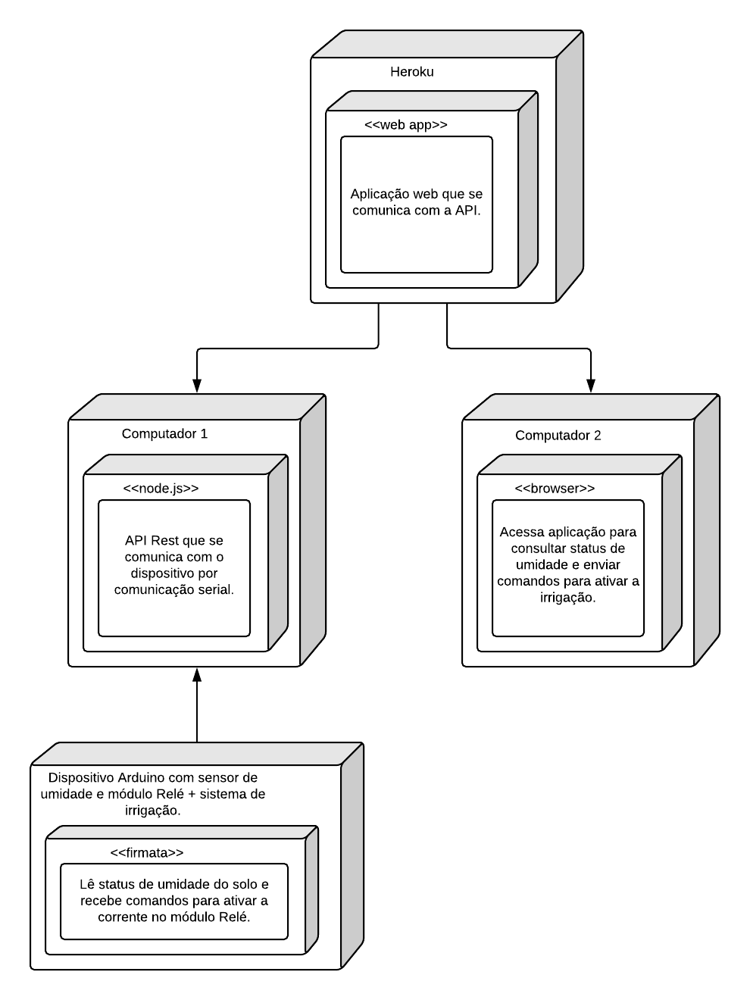

# *Nome do Projeto*

## Ideia

Uma aplicação web que acompanha o status de umidade do solo através de um sensor e aciona o sistema de irrigação integrado em um dispositivo arduino.

## Diagrama de implantação

## Montagem do dispositivo

